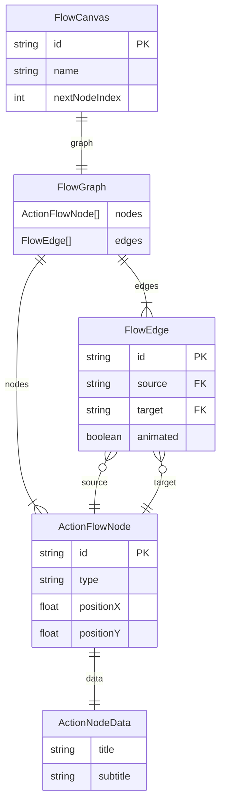
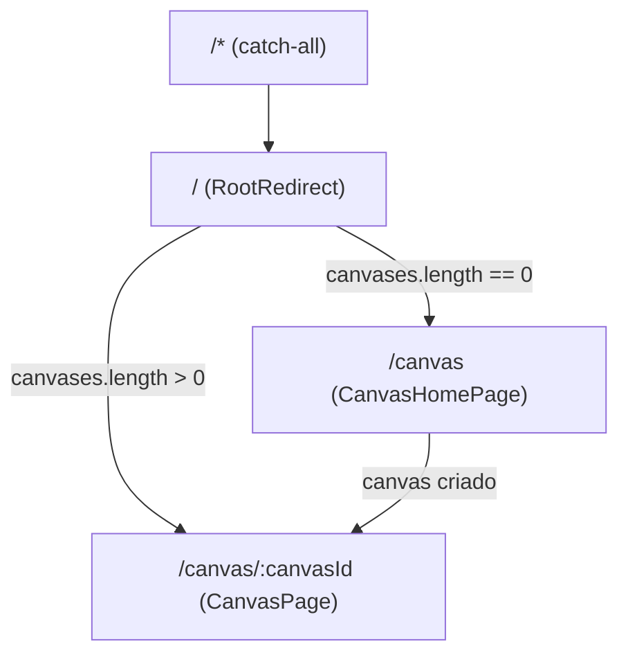
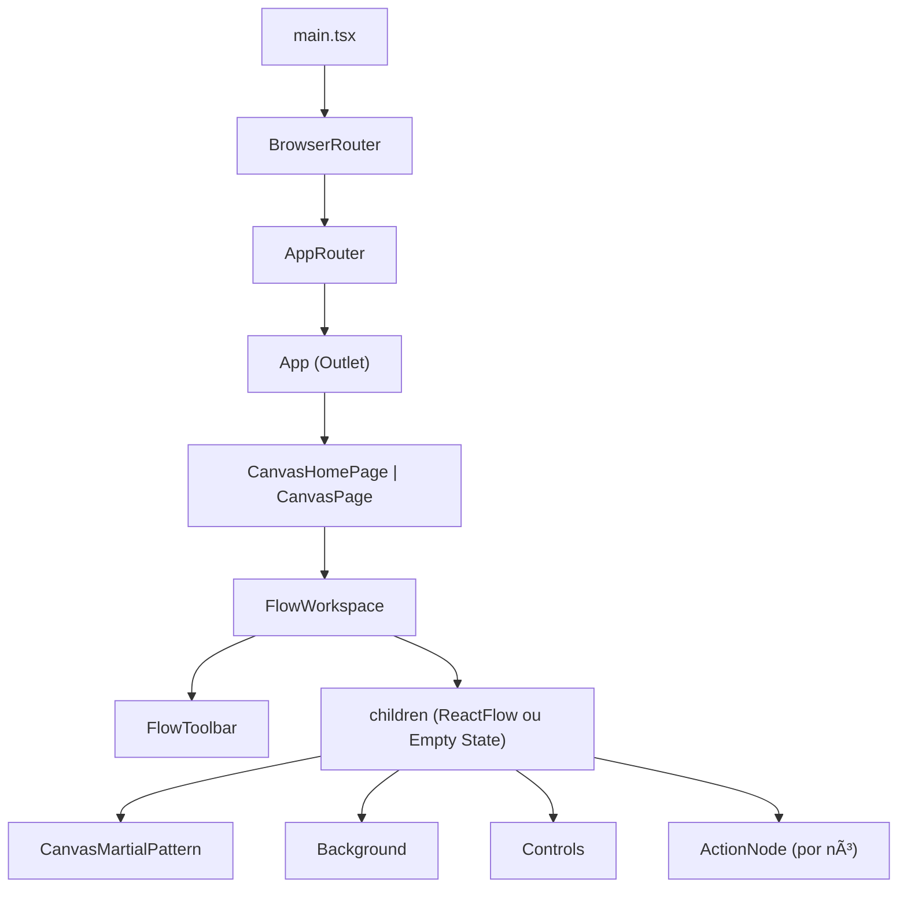

# Relatório Completo da Aplicação — Frontend

> **Objetivo**: Servir como base para planejamento da API backend.
> A aplicação foi construída **frontend‑first** — todo o estado hoje vive no cliente.

---

## 1. Visão Geral

**Frontend** é um editor de fluxos visuais (flow/canvas) voltado a construção de pipelines de passos de ação. O usuário cria **canvases**, cada um contendo um **grafo** de nós e arestas que representam o fluxo de trabalho.

### Stack Técnica

| Camada           | Tecnologia                            | Versão  |
| ---------------- | ------------------------------------- | ------- |
| Bundler          | Vite                                  | 7.3.1   |
| Framework        | React                                 | 19.2.0  |
| Linguagem        | TypeScript                            | 5.9.3   |
| State management | Zustand                               | 5.0.11  |
| Editor de fluxos | @xyflow/react                         | 12.10.1 |
| Estilização      | TailwindCSS 4 + Vanilla CSS (App.css) | 4.2.1   |
| Componentes UI   | Radix UI (via shadcn)                 | 1.4.3   |
| Roteamento       | react-router-dom                      | 7.13.1  |
| Ícones           | Lucide React                          | 0.575.0 |
| Testes E2E       | Playwright                            | 1.58.2  |

### Alias de Import

```ts
// vite.config.ts
'@' → './src'
```

---

## 2. Estrutura de Arquivos Completa

```
frontend/
├── src/
│   ├── main.tsx                         # Entry point (BrowserRouter + AppRouter)
│   ├── App.tsx                          # Layout raiz (<Outlet />)
│   ├── App.css                          # Estilos da aplicação (368 linhas)
│   ├── AppRouter.tsx                    # Definição de rotas
│   ├── index.css                        # Tema Tailwind + design tokens (195 linhas)
│   │
│   ├── lib/
│   │   └── utils.ts                     # cn() — clsx + tailwind-merge
│   │
│   ├── components/
│   │   ├── nodes/
│   │   │   └── ActionNode.tsx           # Componente visual do nó
│   │   └── ui/
│   │       ├── button.tsx               # Button (CVA + Radix Slot)
│   │       └── popover.tsx              # Popover (Radix Popover)
│   │
│   └── features/
│       └── flow/
│           ├── domain/
│           │   ├── flow.types.ts        # Tipos de domínio
│           │   └── flow.factory.ts      # Fábricas de entidades
│           ├── store/
│           │   └── useFlowStore.ts      # Zustand store centralizado
│           ├── persistence/
│           │   └── flowPersistencePolicy.ts  # Política de persistência
│           ├── components/
│           │   ├── FlowWorkspace.tsx     # Shell do workspace
│           │   ├── FlowToolbar.tsx       # Toolbar de canvases e nodes
│           │   └── CanvasMartialPattern.tsx  # Background decorativo
│           └── pages/
│               ├── CanvasHomePage.tsx    # Página empty-state / redirect
│               └── CanvasPage.tsx        # Página principal do canvas
│
├── e2e/
│   └── canvas-management.spec.ts        # Testes E2E (Playwright)
│
├── package.json
├── vite.config.ts
├── tsconfig.json / tsconfig.app.json / tsconfig.node.json
├── eslint.config.js
├── playwright.config.ts
└── components.json                      # Configuração shadcn
```

---

## 3. Modelo de Domínio — Tipos de Dados

Todos os tipos estão definidos em [flow.types.ts](file:///c:/Users/juan/Desktop/idkwhyyyy/frontend/src/features/flow/domain/flow.types.ts).

### 3.1 ActionNodeData

Dados de conteúdo de um nó de ação.

```ts
type ActionNodeData = {
  title: string; // Título exibido no nó (ex: "Entrada", "Validação")
  subtitle: string; // Descrição curta (ex: "Coleta de contexto da tarefa")
};
```

### 3.2 ActionFlowNode

Nó tipado do @xyflow/react com tipo `'action'`.

```ts
type ActionFlowNode = Node<ActionNodeData, "action">;
```

> Herda de `Node` do @xyflow: contém `id: string`, `position: { x, y }`, `type: 'action'`, `data: ActionNodeData`, e opcionais como `selected`, `dragging`, etc.

### 3.3 FlowEdge

Aresta genérica do @xyflow/react.

```ts
type FlowEdge = Edge;
```

> Contém `id: string`, `source: string`, `target: string`, e opcionais como `animated: boolean`, `sourceHandle`, `targetHandle`, etc.

### 3.4 FlowGraph

Representa o grafo completo de um canvas.

```ts
type FlowGraph = {
  nodes: ActionFlowNode[]; // Lista de nós
  edges: FlowEdge[]; // Lista de arestas
};
```

### 3.5 FlowCanvas

**Entidade principal da aplicação.** Representa um canvas com nome, grafo e controle de indexação.

```ts
type FlowCanvas = {
  id: string; // ID único (ex: "canvas-a1b2c3d4")
  name: string; // Nome exibido ao usuário
  graph: FlowGraph; // Grafo com nós e arestas
  nextNodeIndex: number; // Próximo índice para criação de nó
};
```

### 3.6 FlowCanvasSummary

Projeção leve do canvas para listagens.

```ts
type FlowCanvasSummary = Pick<FlowCanvas, "id" | "name">;
```

### Diagrama de Relacionamento de Entidades



---

## 4. Fábricas de Entidades (Factory)

Todas as funções de criação estão em [flow.factory.ts](file:///c:/Users/juan/Desktop/idkwhyyyy/frontend/src/features/flow/domain/flow.factory.ts).

### 4.1 createCanvasId()

Gera um ID único usando `crypto.randomUUID()`.

```ts
// Retorno: "canvas-a1b2c3d4"
function createCanvasId(): string;
```

### 4.2 createCanvasModel(input)

Cria um `FlowCanvas` completo com grafo inicial.

```ts
function createCanvasModel(input: { id: string; name: string }): FlowCanvas;
```

O grafo inicial (`INITIAL_FLOW`) contém **3 nós** e **2 arestas**:

| Nó ID      | Título    | Subtítulo                      | Posição    |
| ---------- | --------- | ------------------------------ | ---------- |
| `start`    | Entrada   | Coleta de contexto da tarefa   | (80, 120)  |
| `validate` | Validação | Checagem de regras e estrutura | (380, 120) |
| `done`     | Saída     | Retorno final da execução      | (680, 120) |

| Aresta ID        | Source     | Target     |
| ---------------- | ---------- | ---------- |
| `start-validate` | `start`    | `validate` |
| `validate-done`  | `validate` | `done`     |

O `nextNodeIndex` é inicializado como `graph.nodes.length + 1` (ou seja, `4`).

### 4.3 createActionNode(nodeIndex)

Cria um novo nó de ação com posição calculada por grid.

```ts
function createActionNode(nodeIndex: number): ActionFlowNode;
```

**Layout em grid:**

```ts
const GRID_LAYOUT = {
  columns: 3, // 3 colunas
  startX: 80, // offset X inicial
  startY: 280, // offset Y inicial (abaixo dos nós iniciais)
  stepX: 300, // espaçamento horizontal
  stepY: 150, // espaçamento vertical
};
```

- ID gerado: `step-{nodeIndex}` (ex: `step-4`)
- Título padrão: `Passo {nodeIndex}`
- Subtítulo padrão: `"Novo bloco para seu fluxo"`

### 4.4 createLinkedEdge(sourceId, targetId)

Cria uma aresta animada entre dois nós.

```ts
function createLinkedEdge(sourceId: string, targetId: string): FlowEdge;
// { id: "sourceId-targetId", source: sourceId, target: targetId, animated: true }
```

---

## 5. Store — Zustand (Estado Global)

O store é definido em [useFlowStore.ts](file:///c:/Users/juan/Desktop/idkwhyyyy/frontend/src/features/flow/store/useFlowStore.ts).

### 5.1 Estado

```ts
type FlowState = {
  canvases: FlowCanvas[]; // Array de todos os canvases
  persistenceMode: PersistenceMode; // 'guest-local' | 'authenticated-api'
};
```

### 5.2 Ações (Operações)

Abaixo, cada ação do store documentada em detalhe, pronta para ser mapeada a endpoints de API:

---

#### `createCanvas(name: string): string`

**Operação**: Criação de canvas  
**Parâmetros**: `name` — nome do canvas (string)  
**Lógica**:

1. Gera um novo `canvasId` via `createCanvasId()`
2. Se o nome estiver vazio/whitespace, usa fallback `"Canvas {n+1}"`
3. Cria o canvas com `createCanvasModel({ id, name })`
4. Adiciona ao final do array `canvases`
5. Retorna o `canvasId` criado

**Dados retornados**: `string` (canvasId)

> [!IMPORTANT]
> **Equivalente API**: `POST /canvases` com body `{ name }` → retorna `{ id, name, graph, nextNodeIndex }`

---

#### `renameCanvas(canvasId: string, nextName: string): void`

**Operação**: Renomeação de canvas  
**Parâmetros**: `canvasId`, `nextName`  
**Lógica**:

1. Localiza o canvas pelo `canvasId`
2. Normaliza o nome (trim); se vazio, mantém o nome anterior
3. Atualiza o campo `name`

> [!IMPORTANT]
> **Equivalente API**: `PATCH /canvases/:canvasId` com body `{ name }`

---

#### `deleteCanvas(canvasId: string, activeCanvasId: string | null): string | null`

**Operação**: Exclusão de canvas  
**Parâmetros**: `canvasId` (canvas a excluir), `activeCanvasId` (canvas ativo atualmente na view)  
**Lógica**:

1. Localiza o índice do canvas pelo `canvasId`
2. Se não encontrado, retorna sem mudança
3. Filtra o canvas removido da lista
4. Se a lista ficou vazia, retorna `null` (sem canvas ativo)
5. Se o canvas excluído era o ativo, calcula um fallback:
   - Tenta o canvas no mesmo índice → senão, o anterior → senão, o primeiro
6. Retorna o `nextActiveCanvasId`

> [!IMPORTANT]
> **Equivalente API**: `DELETE /canvases/:canvasId`
> O roteamento para o próximo canvas é responsabilidade do frontend.

---

#### `addActionNodeToCanvas(canvasId: string): void`

**Operação**: Adição de novo nó de ação a um canvas  
**Parâmetros**: `canvasId`  
**Lógica**:

1. Localiza o canvas pelo `canvasId`
2. Cria novo nó com `createActionNode(canvas.nextNodeIndex)`
3. Se houver nós existentes, cria uma aresta do **último nó** para o **novo nó**
4. Adiciona o nó e a aresta ao grafo
5. Incrementa `nextNodeIndex`

> [!IMPORTANT]
> **Equivalente API**: `POST /canvases/:canvasId/nodes` → retorna `{ node, edge? }`

---

#### `connectNodesByCanvas(canvasId: string, connection: Connection): void`

**Operação**: Conexão manual entre dois nós (drag de handle)  
**Parâmetros**: `canvasId`, `connection` (contém `source` e `target`)  
**Lógica**:

1. Valida que `source` e `target` existem
2. Adiciona a aresta ao grafo via `addEdge()` do @xyflow, com `animated: true`

> [!IMPORTANT]
> **Equivalente API**: `POST /canvases/:canvasId/edges` com body `{ source, target }`

---

#### `handleNodesChangeByCanvas(canvasId: string, changes: NodeChange[]): void`

**Operação**: Atualização batch de nós (posição, seleção, remoção)  
**Parâmetros**: `canvasId`, `changes` (array de `NodeChange` do @xyflow)  
**Lógica**: Aplica as mudanças via `applyNodeChanges()` do @xyflow.

Tipos de `NodeChange` possíveis (definidos pelo @xyflow):

- `NodePositionChange` — usuário arrastou o nó
- `NodeSelectionChange` — seleção mudou
- `NodeRemoveChange` — nó deletado (via tecla Delete)
- `NodeDimensionChange` — dimensões mudaram
- `NodeAddChange` — nó adicionado (não usado diretamente aqui)

> [!IMPORTANT]
> **Equivalente API**: `PATCH /canvases/:canvasId/nodes` com batch de alterações.
> Considerar debounce para mudanças de posição para não sobrecarregar a API.

---

#### `handleEdgesChangeByCanvas(canvasId: string, changes: EdgeChange[]): void`

**Operação**: Atualização batch de arestas (remoção, seleção)  
**Parâmetros**: `canvasId`, `changes` (array de `EdgeChange` do @xyflow)  
**Lógica**: Aplica as mudanças via `applyEdgeChanges()` do @xyflow.

> [!IMPORTANT]
> **Equivalente API**: `PATCH /canvases/:canvasId/edges` ou `DELETE /canvases/:canvasId/edges/:edgeId`

---

#### `hasCanvas(canvasId: string): boolean`

**Operação**: Verificação de existência (somente leitura, usada internamente)  
**Não precisa de endpoint direto**, pois é derivado do listagem.

---

### 5.3 Resumo de Operações (Mapa para API)

| Operação Frontend                | Método HTTP Sugerido | Endpoint Sugerido     | Body / Params        |
| -------------------------------- | -------------------- | --------------------- | -------------------- |
| `createCanvas`                   | `POST`               | `/canvases`           | `{ name }`           |
| `renameCanvas`                   | `PATCH`              | `/canvases/:id`       | `{ name }`           |
| `deleteCanvas`                   | `DELETE`             | `/canvases/:id`       | —                    |
| `addActionNodeToCanvas`          | `POST`               | `/canvases/:id/nodes` | —                    |
| `connectNodesByCanvas`           | `POST`               | `/canvases/:id/edges` | `{ source, target }` |
| `handleNodesChangeByCanvas`      | `PATCH`              | `/canvases/:id/nodes` | `{ changes: [...] }` |
| `handleEdgesChangeByCanvas`      | `PATCH` / `DELETE`   | `/canvases/:id/edges` | `{ changes: [...] }` |
| Listar canvases (implícito)      | `GET`                | `/canvases`           | —                    |
| Buscar canvas por ID (implícito) | `GET`                | `/canvases/:id`       | —                    |

---

## 6. Persistência

Definida em [flowPersistencePolicy.ts](file:///c:/Users/juan/Desktop/idkwhyyyy/frontend/src/features/flow/persistence/flowPersistencePolicy.ts).

### 6.1 Modos de Persistência

```ts
type PersistenceMode = "guest-local" | "authenticated-api";
```

| Modo                | Storage                       | Descrição                                               |
| ------------------- | ----------------------------- | ------------------------------------------------------- |
| `guest-local`       | `localStorage`                | Dados salvos no navegador do usuário (sem autenticação) |
| `authenticated-api` | `noopStorage` _(placeholder)_ | Preparado para futura integração com API (noop hoje)    |

### 6.2 Chave de Storage

```ts
FLOW_PERSIST_STORAGE_KEY = "flow-canvases-v1";
```

### 6.3 Dados Persistidos

O Zustand `persist` middleware serializa **apenas o array `canvases`**:

```ts
partialize: (state) => ({
  canvases: state.canvases,
});
```

### 6.4 Formato no localStorage

```json
{
  "state": {
    "canvases": [
      {
        "id": "canvas-a1b2c3d4",
        "name": "Meu Canvas",
        "graph": {
          "nodes": [
            {
              "id": "start",
              "type": "action",
              "data": {
                "title": "Entrada",
                "subtitle": "Coleta de contexto da tarefa"
              },
              "position": { "x": 80, "y": 120 }
            }
          ],
          "edges": [
            { "id": "start-validate", "source": "start", "target": "validate" }
          ]
        },
        "nextNodeIndex": 4
      }
    ]
  },
  "version": 1
}
```

### 6.5 Decisão de Modo

```ts
function getAuthSnapshot(): AuthSnapshot {
  return { isAuthenticated: false }; // TODO(auth): leitura real
}
```

Atualmente **sempre retorna `guest-local`**. A função `resolvePersistenceMode()` está preparada para ler o estado de autenticação futuro e trocar para `authenticated-api`.

> [!WARNING]
> Quando a API existir, o modo `authenticated-api` deve substituir o `localStorage` pelo fetch/mutation à API. O `noopStorage` atual garante que nenhum dado é escrito em local quando autenticado — os dados virão do servidor.

---

## 7. Roteamento

Definido em [AppRouter.tsx](file:///c:/Users/juan/Desktop/idkwhyyyy/frontend/src/AppRouter.tsx).



| Rota                | Componente       | Descrição                                                 |
| ------------------- | ---------------- | --------------------------------------------------------- |
| `/`                 | `RootRedirect`   | Redirect para primeiro canvas ou `/canvas`                |
| `/canvas`           | `CanvasHomePage` | Empty state — instrui o usuário a criar o primeiro canvas |
| `/canvas/:canvasId` | `CanvasPage`     | Renderiza o editor de fluxo do canvas ativo               |
| `/*`                | `RootRedirect`   | Catch-all para rotas inexistentes                         |

### Lógica de Redirecionamento

- **CanvasHomePage**: Se já existe pelo menos um canvas, redireciona automaticamente para ele via `<Navigate>`.
- **CanvasPage**: Se o `canvasId` da URL não existe, redireciona para o primeiro canvas disponível. Se não existe nenhum canvas, redireciona para `/canvas`.

---

## 8. Componentes — Árvore Completa

### 8.1 Hierarquia



### 8.2 ActionNode

Arquivo: [ActionNode.tsx](file:///c:/Users/juan/Desktop/idkwhyyyy/frontend/src/components/nodes/ActionNode.tsx)

Componente visual do nó de ação no editor de fluxos.

- **Props**: `data: ActionNodeData`, `selected: boolean`
- **Handles**:
  - `target` na posição `Left` (entrada)
  - `source` na posição `Right` (saída)
- **CSS**: `.action-node`, `.action-node--selected`

### 8.3 FlowWorkspace

Arquivo: [FlowWorkspace.tsx](file:///c:/Users/juan/Desktop/idkwhyyyy/frontend/src/features/flow/components/FlowWorkspace.tsx)

Shell do workspace que conecta o store à toolbar e ao conteúdo.

- **Props**: `activeCanvasId?`, `children`, `nodeActionsDisabled?`, `onAddNode`
- **Responsabilidades**:
  - Extrai `canvasSummaries` do store
  - Conecta `createCanvas`, `renameCanvas`, `deleteCanvas` do store ao `FlowToolbar`
  - Gerencia navegação entre canvases

### 8.4 FlowToolbar

Arquivo: [FlowToolbar.tsx](file:///c:/Users/juan/Desktop/idkwhyyyy/frontend/src/features/flow/components/FlowToolbar.tsx)

Barra de ferramentas fixa no canto superior esquerdo.

**Dois popovers:**

1. **Popover de Canvases** (ícone `FolderKanban`):
   - Input para criar novo canvas
   - Lista de canvases existentes
   - Para cada canvas: abrir, renomear (inline editing), excluir
   - Badge "Ativo" no canvas ativo
   - Validações: botão "Criar" desabilitado se nome vazio

2. **Popover de Nodes** (ícone `Plus`):
   - Botão "Adicionar novo nó" (desabilitado se sem canvas ativo)

**Estado local do componente:**

- `isCanvasPopoverOpen: boolean`
- `newCanvasName: string`
- `isCreatingCanvas: boolean`
- `editingCanvasId: string | null`
- `editingCanvasName: string`

### 8.5 CanvasPage

Arquivo: [CanvasPage.tsx](file:///c:/Users/juan/Desktop/idkwhyyyy/frontend/src/features/flow/pages/CanvasPage.tsx)

Página principal renderizando o `ReactFlow` com:

- `nodeTypes` customizado (`action → ActionNode`)
- `fitView` habilitado
- `Background` com gap 20 e size 1.2
- `Controls` do @xyflow
- `CanvasMartialPattern` como background decorativo

**Callbacks**: `onConnect`, `onNodesChange`, `onEdgesChange`, `onAddNode` — todos delegam para o store com o `canvasId` da URL.

### 8.6 CanvasMartialPattern

Arquivo: [CanvasMartialPattern.tsx](file:///c:/Users/juan/Desktop/idkwhyyyy/frontend/src/features/flow/components/CanvasMartialPattern.tsx)

Background decorativo com grid de ícones de artes marciais (Swords, HandFist, Target, Shield, Flame). Calcula quantidade de ícones baseado no tamanho da viewport. Responsivo ao resize.

---

## 9. Design System

### 9.1 Tema

Definido em [index.css](file:///c:/Users/juan/Desktop/idkwhyyyy/frontend/src/index.css) com variáveis CSS usando **oklch**.

- **Dois temas**: Light (`:root`) e Dark (`.dark`)
- **Tipografia**: `ui-monospace, 'JetBrains Mono', 'Fira Code', 'Menlo', monospace`
- **Border radius**: `0rem` (estilo brutalist/angular)
- **Sombras**: Offset fixo (2px light, 3px dark) sem blur — estilo neo-brutalist

### 9.2 Paleta de Cores Principais

| Token           | Papel                          | Hue (approx)    |
| --------------- | ------------------------------ | --------------- |
| `--primary`     | Ações primárias, handles, ring | Verde (~153°)   |
| `--secondary`   | Ações secundárias              | Laranja (~61°)  |
| `--destructive` | Ações destrutivas              | Vermelho (~22°) |
| `--muted`       | Backgrounds sutis              | Verde claro     |
| `--accent`      | Hovers e destaques             | Verde claro     |

### 9.3 Componentes UI (shadcn)

#### Button (button.tsx)

Variantes de `variant`:

- `default`, `destructive`, `outline`, `secondary`, `ghost`, `link`

Variantes de `size`:

- `default`, `xs`, `sm`, `lg`, `icon`, `icon-xs`, `icon-sm`, `icon-lg`

#### Popover (popover.tsx)

Sub-componentes: `Popover`, `PopoverTrigger`, `PopoverContent`, `PopoverAnchor`, `PopoverHeader`, `PopoverTitle`, `PopoverDescription`

---

## 10. Cobertura de Testes E2E

Arquivo: [canvas-management.spec.ts](file:///c:/Users/juan/Desktop/idkwhyyyy/frontend/e2e/canvas-management.spec.ts)

| Teste                            | O que valida                                                                 |
| -------------------------------- | ---------------------------------------------------------------------------- |
| Empty state e validação de botão | Mostra mensagem vazia, botão "Criar" desabilitado com input vazio/whitespace |
| Criação e navegação              | Cria canvases, navega entre eles, verifica URLs e badge "Ativo"              |
| Renomeação e exclusão            | Edição inline, exclusão com fallback de rota para outro canvas               |
| Persistência (guest)             | Dados sobrevivem ao reload via localStorage                                  |

---

## 11. Fluxo de Dados Completo

```mermaid
sequenceDiagram
    actor User
    participant UI as FlowToolbar / CanvasPage
    participant Store as useFlowStore (Zustand)
    participant Factory as flow.factory
    participant Persist as Zustand Persist Middleware
    participant Storage as localStorage

    Note over User,Storage: Criação de Canvas
    User->>UI: Digita nome + clica "Criar"
    UI->>Store: createCanvas("Meu Canvas")
    Store->>Factory: createCanvasId()
    Factory-->>Store: "canvas-abc123"
    Store->>Factory: createCanvasModel({ id, name })
    Factory-->>Store: FlowCanvas com grafo inicial
    Store->>Persist: set({ canvases: [...canvases, newCanvas] })
    Persist->>Storage: setItem("flow-canvases-v1", JSON)
    Store-->>UI: canvasId
    UI->>UI: navigate(/canvas/canvas-abc123)

    Note over User,Storage: Adição de Nó
    User->>UI: Clica "Adicionar novo nó"
    UI->>Store: addActionNodeToCanvas("canvas-abc123")
    Store->>Factory: createActionNode(4)
    Factory-->>Store: ActionFlowNode
    Store->>Factory: createLinkedEdge(lastNodeId, newNodeId)
    Factory-->>Store: FlowEdge
    Store->>Persist: set({ canvases: updated })
    Persist->>Storage: setItem("flow-canvases-v1", JSON)

    Note over User,Storage: Conexão Manual
    User->>UI: Drag handle source → target
    UI->>Store: connectNodesByCanvas("canvas-abc123", connection)
    Store->>Persist: set({ canvases: updated })
    Persist->>Storage: setItem("flow-canvases-v1", JSON)

    Note over User,Storage: Movimentação de Nó
    User->>UI: Drag nó para nova posição
    UI->>Store: handleNodesChangeByCanvas("canvas-abc123", positionChanges)
    Store->>Persist: set({ canvases: updated })
    Persist->>Storage: setItem("flow-canvases-v1", JSON)
```



---

## 12. Pontos Relevantes para Planejamento da API

### 12.1 O que a API precisa cobrir

1. **Autenticação de usuários** — hoje não existe, mas o `PersistenceMode` já prevê `'authenticated-api'`
2. **CRUD completo de Canvases** — criar, listar, buscar por ID, renomear, excluir
3. **CRUD de Nós** dentro de um canvas — criar, atualizar posição, remover
4. **CRUD de Arestas** dentro de um canvas — criar, remover
5. **Persistência do grafo** — nós com posição (x, y), dados (title, subtitle), e arestas com source/target

### 12.2 Campos que a API precisa gerenciar

| Entidade   | Campos                                                          | Notas                                          |
| ---------- | --------------------------------------------------------------- | ---------------------------------------------- |
| **User**   | id, email, password, ...                                        | Não existe no frontend hoje                    |
| **Canvas** | id, name, nextNodeIndex, userId (FK), createdAt, updatedAt      | `nextNodeIndex` pode ser gerenciado no backend |
| **Node**   | id, canvasId (FK), type, title, subtitle, positionX, positionY  | type sempre `'action'` hoje                    |
| **Edge**   | id, canvasId (FK), source (FK→Node), target (FK→Node), animated | animated sempre `true` hoje                    |

### 12.3 Considerações de Design

> [!WARNING]
> **Debounce de posição**: Quando o usuário arrasta nós, `handleNodesChangeByCanvas` é chamado em alta frequência. A API deve considerar um mecanismo de debounce/throttle no frontend ou batch update no backend para evitar excesso de requests.

> [!NOTE]
> **`nextNodeIndex`**: Este campo é usado para gerar IDs únicos e posições em grid. No backend, pode ser substituído por auto-increment ou UUID + cálculo de posição server-side.

> [!NOTE]
> **Grafo inicial**: Ao criar um canvas, 3 nós e 2 arestas são criados automaticamente. Essa lógica pode ser replicada no backend ou mantida no frontend fazendo uma chamada `POST /canvases` seguida de `POST /canvases/:id/nodes` para cada nó.

> [!TIP]
> **Alternativa mais simples**: Em vez de endpoints granulares de nós e arestas, a API pode aceitar um `PATCH /canvases/:id` com o grafo inteiro (nós + arestas), salvando tudo de uma vez. Isso simplifica a integração em troca de maior payload.
